# Simple Data Entry (DHIS2 Android)

<p align="left">
  
  
  
  
  
  
</p>

Simple Data Entry is a native Android client for DHIS2 focused on fast, reliable data capture in low-connectivity environments. It supports dataset reporting, standalone event capture, and tracker workflows with consistent card-based screens, offline caching, and deliberate, user-controlled sync. Developed by HISP Uganda.

## Highlights

- Dataset reporting with sectioned entry, validation, and clear status feedback
- Event programs with card and line-list views, creation, and editing
- Tracker programs with enrollments, stage events, and profile details
- Offline-first behavior with cached metadata and locally stored drafts
- Manual and login-time sync flows to avoid surprise bandwidth usage

## Tech stack

- Kotlin + Jetpack Compose (UI)
- DHIS2 Android SDK + Rules Engine
- MVVM + StateFlow + repositories
- Hilt (DI), Room (offline persistence), WorkManager (background sync)

## Project layout

- `app/` - Android application source (Compose UI, ViewModels, repositories)

## Architecture at a glance

- Presentation layer: Compose screens + ViewModels, navigation in `app/src/main/java/com/ash/simpledataentry/navigation`
- Domain layer: use cases and models under `app/src/main/java/com/ash/simpledataentry/domain`
- Data layer: repositories + Room + sync services under `app/src/main/java/com/ash/simpledataentry/data`
- Sync: WorkManager-backed background sync plus a foreground sync service for explicit user actions

## Flow diagram

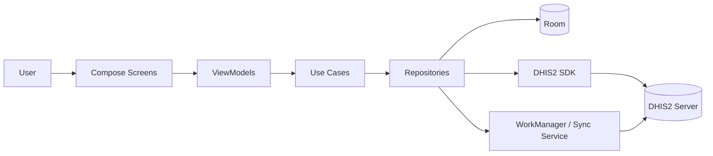

## Getting started

Prerequisites:
- Android Studio (Giraffe or newer) with Android SDK
- JDK 17+ (Android Studio bundled JDK 21 works)

Build debug APK:
```bash
./gradlew assembleDebug
```

Run on a device or emulator:
- Open the project in Android Studio and press Run

## Screenshots

### Authentication
| Login | Sync Progress |
|:---:|:---:|
|  | 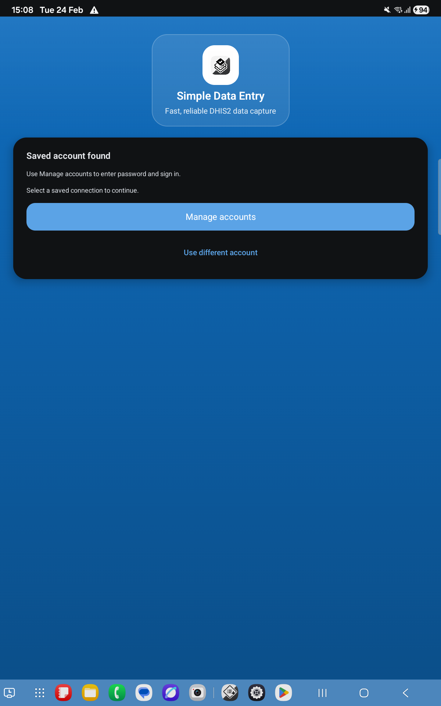 |

### Home & Navigation
| Home - All Programs | Datasets Tab |
|:---:|:---:|
| 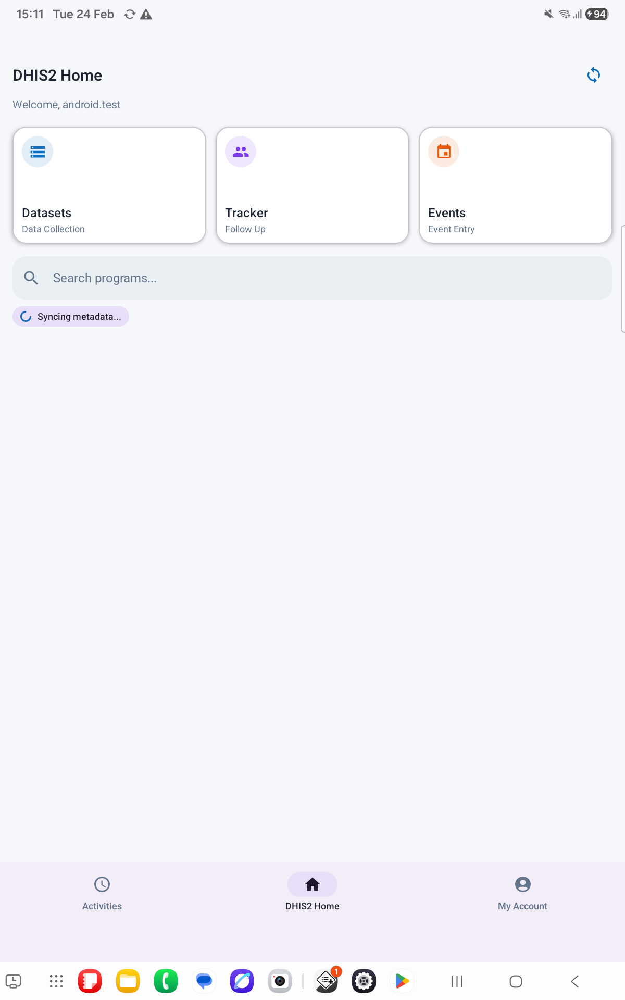 | 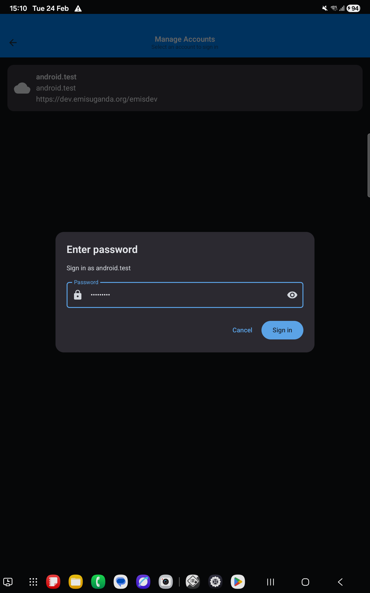 |

### Dataset Data Entry
| Dataset Instances | Data Entry Form |
|:---:|:---:|
| 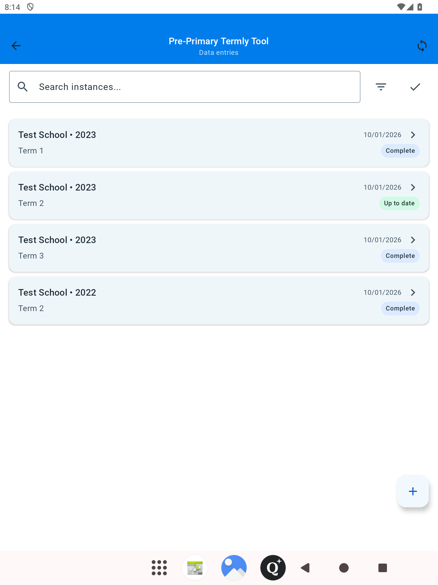 | 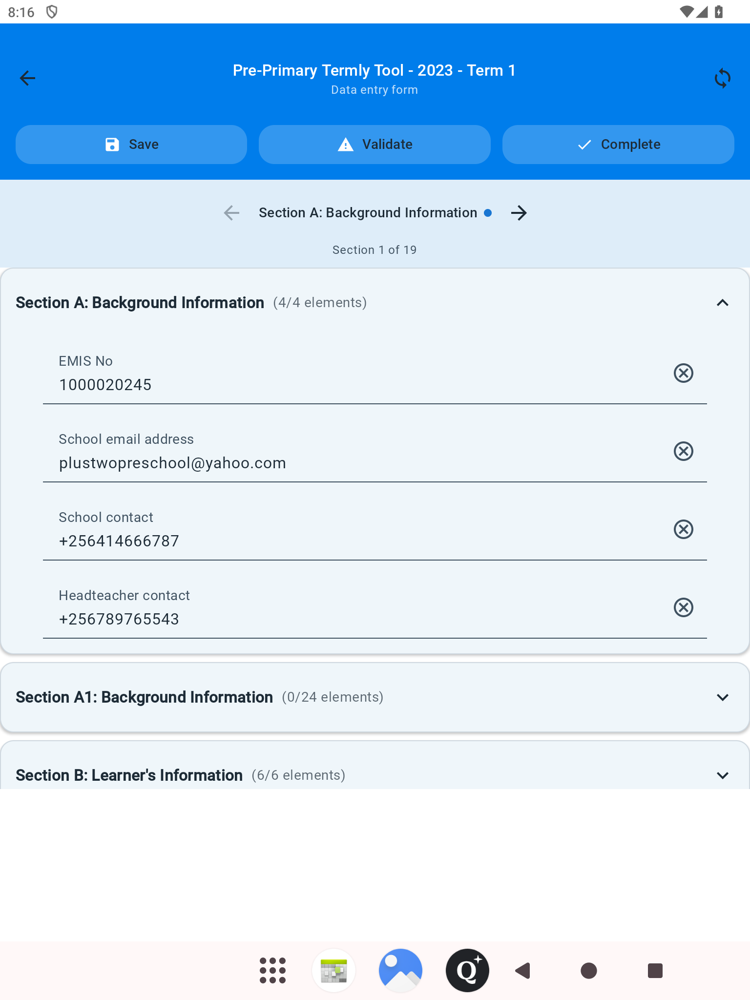 |

| Nested Accordions | Radio Options |
|:---:|:---:|
| 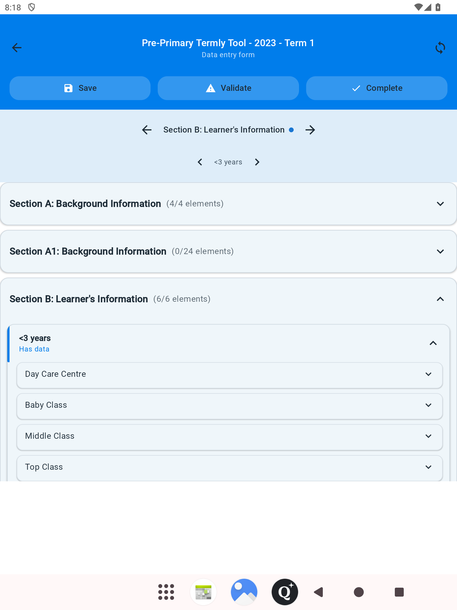 | 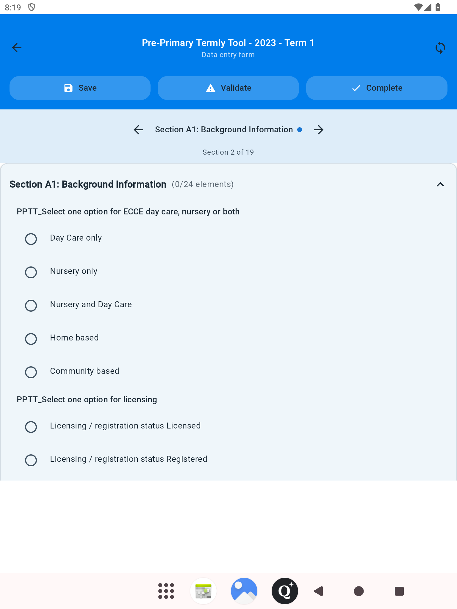 |

| Validation | Unsaved Changes |
|:---:|:---:|
|  | 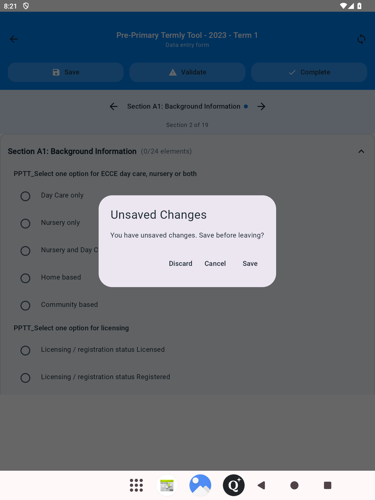 |

### Tracker Programs
| Enrollment List |                  Tracker Dashboard<br/><br/>                   |
|:---:|:---------------------------------------------------------:|
| 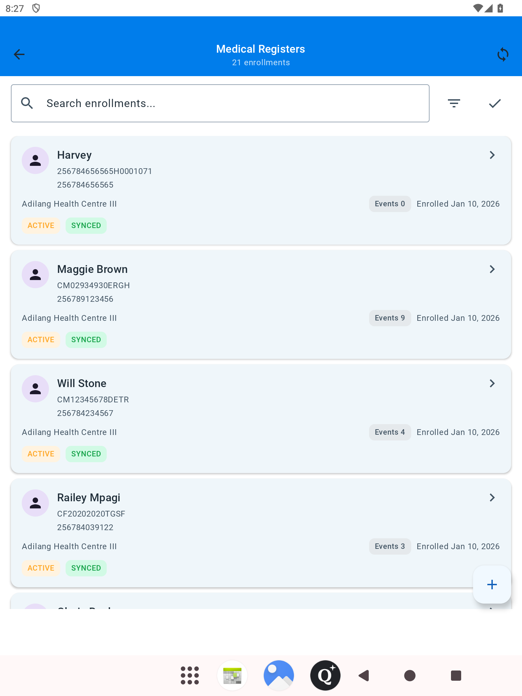 |  |

| Events Summary | Events Table |
|:---:|:---:|
| 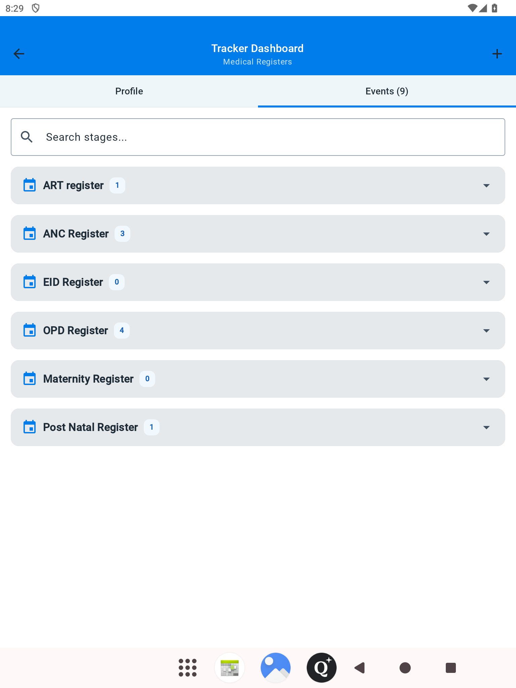 | 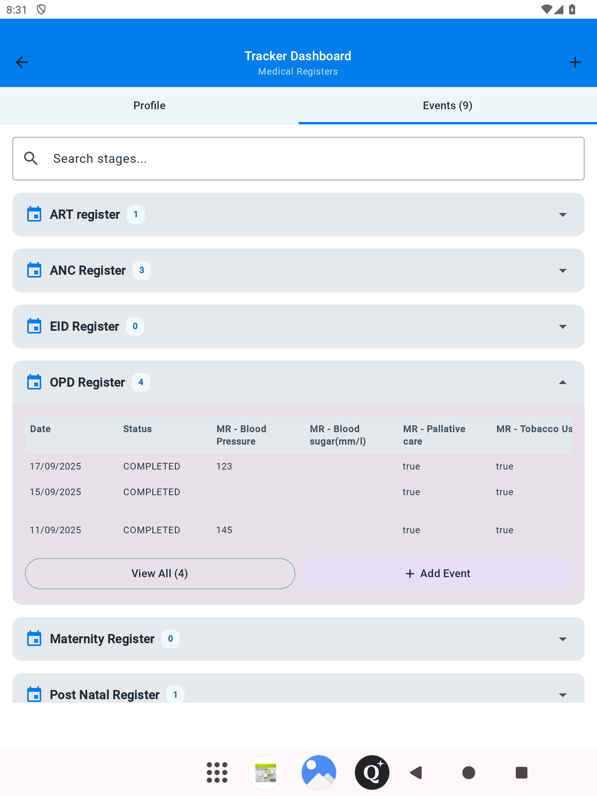 |

| Tracked Entity Profile |
|:---:|
| 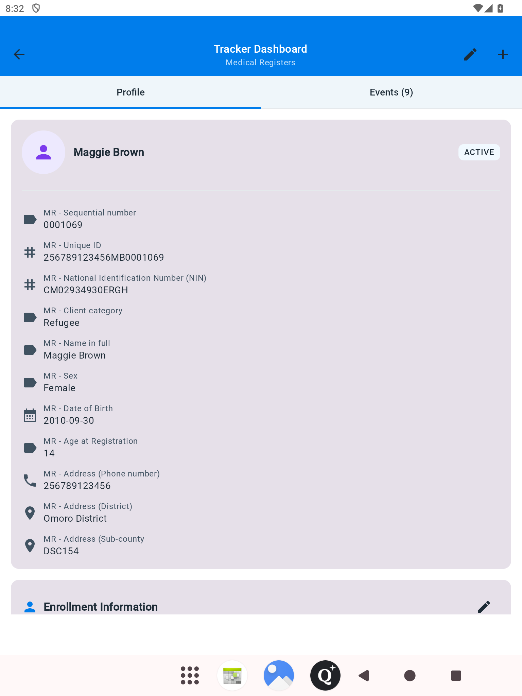 |

## Distribution (GitHub Actions)

Release builds are automated via `.github/workflows/release.yml` and attach APK + AAB artifacts to a GitHub Release on tag push.

Set GitHub Secrets:
- `ANDROID_KEYSTORE_BASE64` - base64 of your `*.jks` file
- `ANDROID_KEYSTORE_PASSWORD`
- `ANDROID_KEY_ALIAS`
- `ANDROID_KEY_PASSWORD`

Example to create the base64 payload:
```bash
base64 < /path/to/keystore.jks
```

Create a release:
```bash
git tag v1.0.0
git push origin v1.0.0
```

Artifacts:
- APK: `app/build/outputs/apk/release/app-release.apk`
- AAB: `app/build/outputs/bundle/release/app-release.aab`

## Configuration

- `local.properties` (ignored) holds your Android SDK path; keep it out of version control.
- Server credentials are entered at runtime via the login flow; no `.env` is required.

## Testing

Unit tests:
```bash
./gradlew test
```

Instrumentation tests:
```bash
./gradlew connectedAndroidTest
```

## Notes

- Sync is intentionally user-driven after login; datasets and metadata use cached values by default.
- Event line lists and tracker stage tables may load data values in the background.

## Contributing

Issues and PRs are welcome. Please describe the use case, expected behavior, and test coverage.

## License

MIT. See `LICENSE`.
