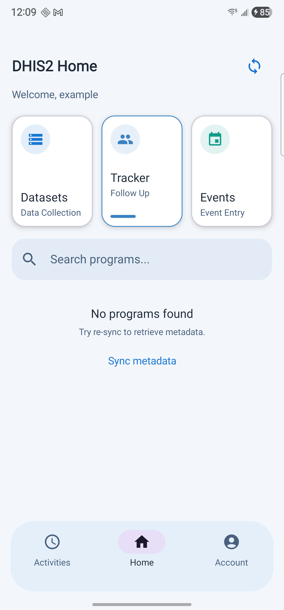
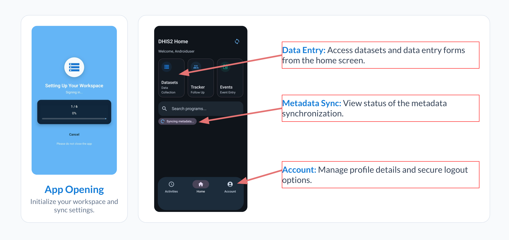
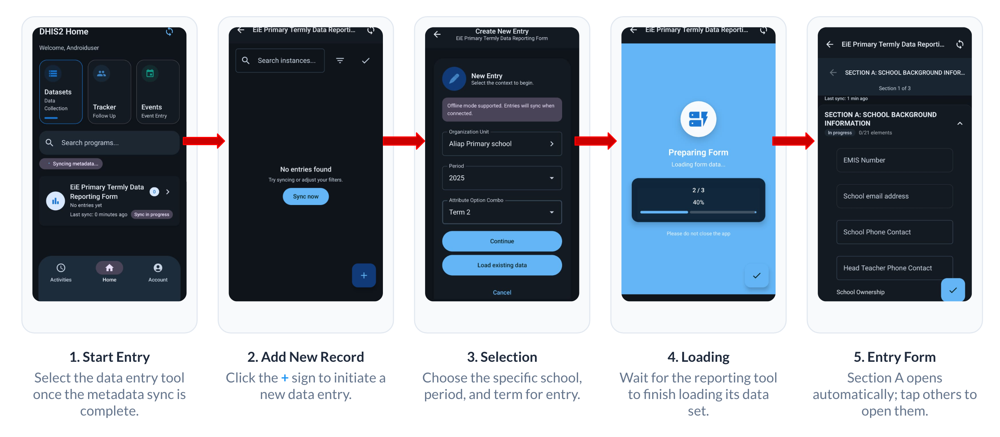
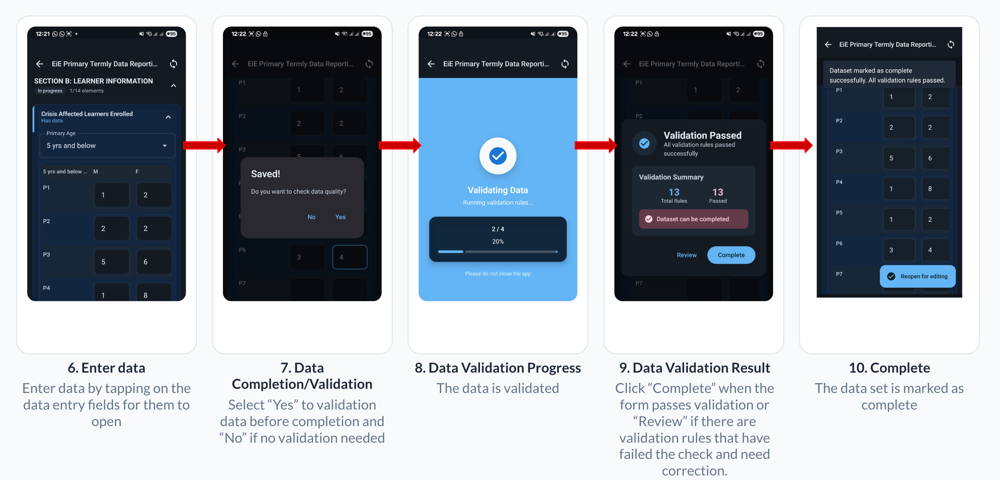
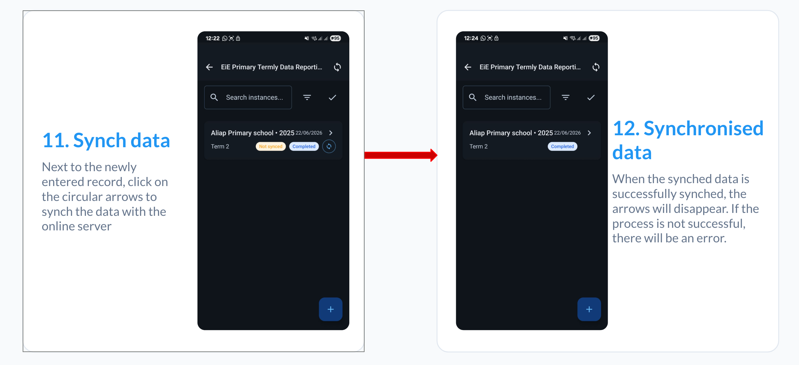
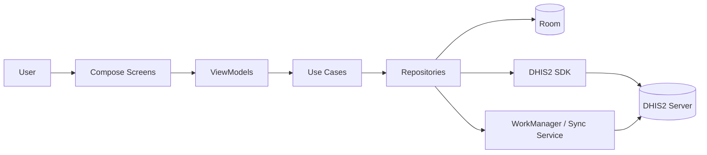

# The Simple Data Entry

<p align="center">
  
</p>

<p align="center">
  <strong>DHIS2 Android data capture built for field teams and district data officers.</strong>
</p>

<p align="center">
  Offline-first. Fast to navigate. Practical in low-connectivity environments.
</p>

<p align="center">
  
  
  
  
  
  
</p>

## Overview

The Simple Data Entry is a native Android client for DHIS2 focused on reliable, field-ready data capture. It supports aggregate dataset reporting, standalone event capture, and tracker workflows with a simpler interaction model, strong offline behavior, and deliberate user-controlled sync.

Built by HISP Uganda.

## Why It Stands Out

- Faster aggregate data entry with structured sections and clearer forms
- Offline-first capture with cached metadata and locally stored drafts
- Tracker and event workflows inside the same app experience
- Manual and background-assisted sync patterns designed to reduce login blocking
- Practical UX for real deployments, especially where connectivity is inconsistent

## Product Glimpse

<p align="center">
  
</p>

<p align="center">
  
</p>

<p align="center">
  
</p>

<p align="center">
  
</p>

## Core Capabilities

### Aggregate Dataset Entry
- Sectioned dataset forms
- Nested accordion-style form layout
- Draft preservation and unsaved-change protection
- Inline validation and completion feedback

### Event Capture
- Standalone event program support
- Card-based and table-oriented list experiences
- Controlled sync and local-first editing

### Tracker Workflows
- Enrollment lists
- Tracker dashboard and stage event views
- Tracked entity profile display

### Sync and Offline Behavior
- Metadata caching for faster reuse
- Background metadata preparation
- Explicit user-driven data sync patterns
- Room-backed local persistence

## Tech Stack

- Kotlin
- Jetpack Compose
- DHIS2 Android SDK
- DHIS2 Rules Engine
- Hilt
- Room
- WorkManager
- MVVM + StateFlow + repository pattern

## Architecture At A Glance


```mermaid
flowchart LR
  User[User] --> UI[Compose Screens]
  UI --> VM[ViewModels]
  VM --> UC[Use Cases]
  UC --> Repo[Repositories]
  Repo --> DB[(Room)]
  Repo --> SDK[DHIS2 SDK]
  SDK --> API[(DHIS2 Server)]
  Repo --> Sync[WorkManager / Sync Service]
  Sync --> API
```

## Project Layout

- `app/` Android application source
- `app/src/main/java/com/ash/simpledataentry/presentation/` Compose screens and ViewModels
- `app/src/main/java/com/ash/simpledataentry/domain/` domain models and use cases
- `app/src/main/java/com/ash/simpledataentry/data/` repositories, Room, session, cache, and sync layers

## Getting Started

### Prerequisites

- Android Studio Giraffe or newer
- Android SDK installed
- JDK 17 or newer

### Build Debug APK

```bash
./gradlew assembleDebug
```

### Run Locally

- Open the project in Android Studio
- Connect a device or start an emulator
- Press `Run`

## Release and Distribution

Release builds are automated through `.github/workflows/release.yml` and publish APK and AAB artifacts on GitHub Release tag pushes.

### Required GitHub Secrets

- `ANDROID_KEYSTORE_BASE64`
- `ANDROID_KEYSTORE_PASSWORD`
- `ANDROID_KEY_ALIAS`
- `ANDROID_KEY_PASSWORD`

### Create Base64 Keystore Payload

```bash
base64 < /path/to/keystore.jks
```

### Create a Release

```bash
git tag v1.0.0
git push origin v1.0.0
```

### Release Artifacts

- APK: `app/build/outputs/apk/release/app-release.apk`
- AAB: `app/build/outputs/bundle/release/app-release.aab`

## Configuration

- `local.properties` is ignored and should contain your Android SDK path
- Server credentials are entered through the runtime login flow
- No `.env` file is required for normal app usage

## Testing

### Unit Tests

```bash
./gradlew test
```

### Instrumentation Tests

```bash
./gradlew connectedAndroidTest
```

## Notes

- Sync is intentionally explicit after login to avoid unnecessary network cost
- Metadata and forms are optimized around cached local availability
- Large-role users benefit from the staged background metadata preparation flow

## Contributing

Issues and pull requests are welcome. When reporting changes, include:

- the user flow or deployment scenario
- the expected behavior
- the observed behavior
- screenshots or logs where relevant
- test coverage for functional changes

## License

MIT. See [LICENSE](LICENSE).
